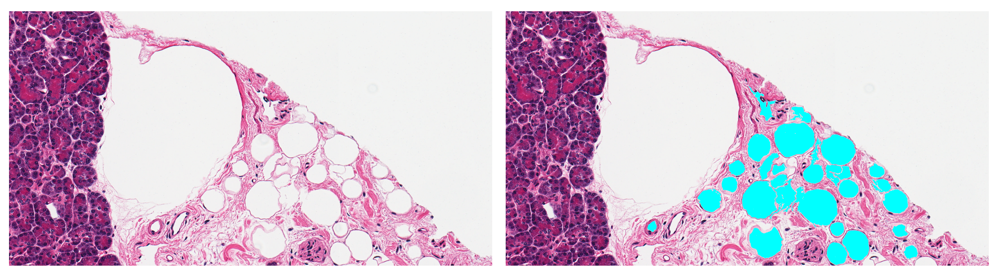

# Fatquant
 An automated image analysis tool for quantification of fat cells

This tool was designed for the experiment mentioned in:
[https://www.sciencedirect.com/science/article/pii/S2667160323000133]

GUI version link:
[[https://github.com/nehalkalita/Fatquant-GUI]

### Requirements for Python programs
* Python 3 distribution: Anaconda
* Other needed Python package name(s): pillow 

## Tutorial
(A raw image `1.tif` and its fat tagged version `1_tagged.png` from the directiory **Pancreas_samples** will be referred to demonstrate fat analysis)

1) Once this repository is downloaded in a local machine, open the Fatquant folder using an IDE that supports Python 3 (e.g. Visual Studio Code).
2) Run the file named `tool_dos.py` under an interpreter of Anaconda and execute options from the menu as per requirements.

#### Option 1
This option allows binary thresholding to be performed on either a raw image or a tagged image in each attempt.

For raw image, users can refer the following inputs:

`Enter threshold value: Pancreas_samples/1.tif`

`Enter threshold value: 230`

For image with manual tagged fats, users can refer the following inputs:

`Enter image name with extension: Pancreas_samples/1_tagged.png`

`Enter 'y' if you want to use default manually tagged color value (R,G,B: 255,255,0): n`

`Enter value for Red channel: 255`

`Enter value for Green channel: 255`

`Enter value for Blue channel: 0`

(*For this image, default color option would have given the output but manual entry of color was chosen to demonstrate what values to enter*)

#### Option 2
This option allows segmentation of white pixels to be performed on binary thresholded raw image or manually tagged image.

For raw image, users can refer the following inputs:

`Enter thresholded image name with extension: Pancreas_samples/1_230.tif`

`Enter 'y' if the thresholded image is of manually tagged data: n`

For image with manual tagged fats, users can refer the following inputs:

`Enter thresholded image name with extension: Pancreas_samples/1_tagged_bi.png`

`Enter 'y' if the thresholded image is of manually tagged data: y`

#### Option 3
This option allows quantification of fats from white segments generated through Option 2.

Users can refer the following inputs:

`Enter original image name with extension: Pancreas_samples/1.tif`

`Enter thresholded image name with extension: Pancreas_samples/1_230.tif`

`Enter output image name (exclude exrtension): Pancreas_samples/1_230`

`Enter 'y' for default white group names: n`

`Enter white groups combined name (extension 'csv'): white_groups_combined.csv`

`Enter white groups segmented name (extension 'csv'): white_groups_segmented.csv`

`Default color value:  
machine tagged value (R,G,B: 0,255,255)`

`Enter 'y' if you want to use this value: n`

`Enter machine tagged value for Red channel: 0`

`Enter machine tagged value for Green channel: 255`

`Enter machine tagged value for Blue channel: 255`

`Enter minimum fat diameter: 27`

`Enter maximum fat diameter: 130`

A file named **1_230_27_130.csv** will be generated which stores the total area (in pixels) identified as fats by Fatquant.

(*Default options for white groups name and color value would have given the output but manual entry was chosen to demonstrate what to enter*)

#### Option 4
This option allows comparison of machine identifed fats (generated through Option 3) with manual tagged fats.

Users can refer the following inputs:

`Enter machine tagged image name with extension: Pancreas_samples/1_230_27_130.tif`

`Enter manual tagged image name with extension: Pancreas_samples/1_tagged.png`

`Enter 'y' for default white group names: n`

`Enter file name for manually tagged white groups combined (extension 'csv'): white_groups_combined_manual.csv`

`Enter file name for manually tagged white groups segmented (extension 'csv'): white_groups_segmented_manual.csv`

`Enter file name for machine tagged fat areas (extension 'csv'): Pancreas_samples/1_230_27_130.csv`

`Default color value:  
machine tagged value (R,G,B: 0,255,255)`

`Enter 'y' if you want to use this value: y`

`Enter manually tagged value for Red channel: 255`

`Enter manually tagged value for Green channel: 255`

`Enter manually tagged value for Blue channel: 0`

`Enter intersection value for Red channel: 127`

`Enter intersection value for Green channel: 255`

`Enter intersection value for Blue channel: 127`

(*Default options for white groups name would have given the output but manual entry was chosen to demonstrate what to enter*)

### Extra programs
There are three programs included in the **extras** folder of this repository which are not needed for running Fatquant tool but their usages are mentioned below.

1) `fat_results_compare_others.py` is used to compare image outputs generated by tools other than Fatquant with manual tagged image.
2) `white_segments_uncombined.py` is used to get a view of white segments where the tiles are not combined. File `tile_size_350_sample.png` is an output generated with this program where the parameter value of `s_size` (tile size) was set to `350`.
